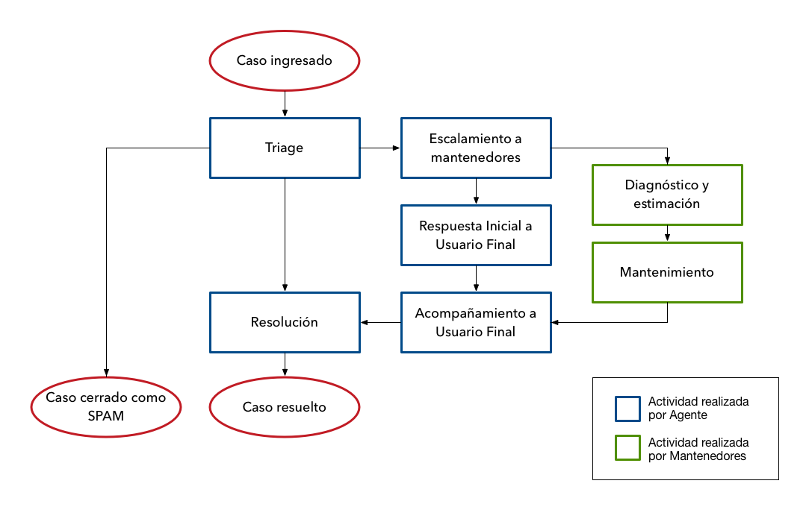

## Modelo de Soporte

### Triage

El Agente debe analizar de forma inmediata cualquier caso entrante y determinar bajo qué concepto atenderlo según la siguiente cadena de decisión:

1. Es SPAM: Marcarlo como tal y no responder.
1. Es un correo a un destinatario errado: responder al Usuario Final indicando que esta casilla es para soporte de productos de modo que esté en conocimiento del error. Luego marcar el caso como SPAM.
1. Es un correo dirigido a un individuo en Unholster: responder al Usuario final indicando que esta casilla es para soporte de productos y proveer el correo directo de la persona con que se está intentando comunicar si es que se conoce, de otro modo referir al Usuario Final a contacto@unholster.com.
1. El caso no está relacionado con un producto mantenido por Unholster: Responder al Usuario Final indicando que la consulta o problema reportado no corresponder a los productos mantenidos por Unholster y proveer una lista de los productos sobre los que Unholster SI provee soporte para ese cliente.
1. El caso se puede resolver proveyendo información al usuario: Ir directo a Resolución, respondiendo al Usuario Final con la información que necesita y/o refiriéndolo a documentación disponible propia del producto.
1. El caso puede resolverse mediante acción documentada por parte del agente: Realizar la acción requerida, confirmar que el resultado es el esperado y que resolvería el caso y luego ir a Resolución respondiendo con el resumen de lo realizado.
1. El caso no puede resolverse sin intervención del equipo de mantenimiento: Realizar el proceso de Escalamiento descrito abajo.

### Escalamiento

Cuando un caso no puede resolverse sin intervención en el producto por parte del equipo de mantenimiento, se debe realizar las siguientes acciones.

#### Escalamiento a mantenedores

En el caso que un caso de soporte requiera de tareas de diagnóstico, mantenimiento o cualquier intervención en el producto, el Agente debe comunicarse con el equipo de mantenimiento del producto asociado al caso mediante el canal Slack correspondiente.

Esta comunicación debiese incluir:

* El reporte original del Usuario Final
* Cualquier antecedente adicional que sirva para el diagnóstico del problema
* Cualquier elemento adicional que el Agente conozca o intuya y que pueda aportar al entendimiento del problema

En el equipo de mantenimiento debe determinarse de forma rápida un encargado de resolver el problema escalado (el Mantenedor).

El Mantenedor debe proveer tan rápido como sea posible:

* Un resumen del diagnóstico del problema
* El grado de certeza respecto a este diagnóstico
* Una estimación del tiempo requerido para resolver el problema
* El grado de confianza respecto a esta estimación

{}
Para efectos de toda comunicación "resolver el problema" significa única y exclusivamente que todos los efectos y síntomas del problema reportado hayan desaparecido para el Usuario Final.
{}

#### Respuesta inicial al Usuario Final

El Agente debe proveer una respuesta inicial al Usuario Final requiriente dentro del menor tiempo posible e idealmente comunicando la siguiente información:

* Si hay información adicional REQUERIDA que el Usuario Final necesita aportar
* Si hay información adicional útil que el Usuario Final podría
aportar
* Cuál es el diagnóstico (en términos tan específicos como sea posible, pero sin entrar en detalles técnicos)
* Cuál es el plazo esperado de resolución para el caso
* Qué acciones adicionales puede tomar el Usuario Final para mitigar el problema o conseguir su objetivo mediante algún método alternativo (workaround)

#### Acompañanmiento al Usuario Final

Después de la respuesta inicial y hasta la resolución del caso, el Agente debe dar respuesta a consultas adicionales que el Usuario Final pueda realizar y/o proveer proactivamente noticias respecto a la evolución del caso.

En cada oportunidad debiese proveer cualquier novedad respecto a la información provista previamente respecto a los mismos temas listados en *Respuesta Inicial*.

### Resolución

Una vez se tenga una resolución al problema (ya sea encontrando una instrucción o recomendación que se pueda proveer al Usuario Final o ya sea habiéndose cumplido la actividad de mantenimiento requerida en el producto) el Agente debe comunicarse con el Usuario Final con la intención de cerrar el caso.

En esta comunicación se entrega la información necesaria al Usuario Final para resolver su problema o comunicar que ha sido corregido en el producto, y se pide la confirmación al Usuario Final. Se indica además que el caso se entenderá como resuelto si no se obtiene respuesta del Usuario Final en los siguientes 7 días.

Cuando el Usuario Final confirme la resolución o cuando hayan expirado los 7 días de plazo para su respuesta, el caso se marcará como RESUELTO.

{}
Un caso nunca debe marcarse como resuelto sin antes recibir la confirmación del Usuario Final o expirado el plazo de confirmación.
{}

### Recursos y herramientas

| Recurso          | URL
| -----------------|----------------------
| Cola de soporte | [soporte.unholster.com](https://soporte.unholster.com)
| Cola de desarrollo | [pivotaltracker.com](https://www.pivotaltracker.com)

El sitio de soporte de Unholster mantiene la cola de casos de soporte de cara a los usuarios finales. Para este sitio utilizamos ZenDesk.

En PivotalTracker se mantienen las colas de desarrollo de todos los proyectos y, en particular, es donde se mantienen los requerimientos escalados desde soporte hacia los mantenedores de un producto.
